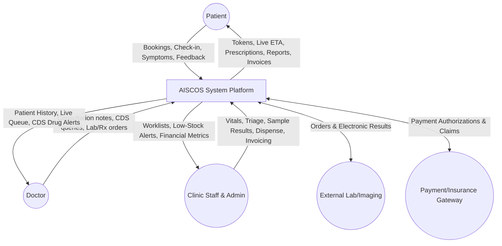
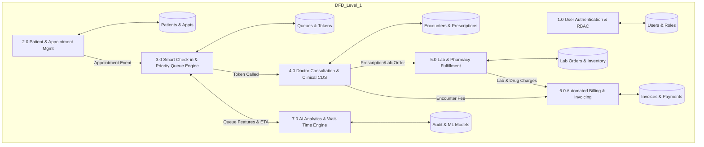
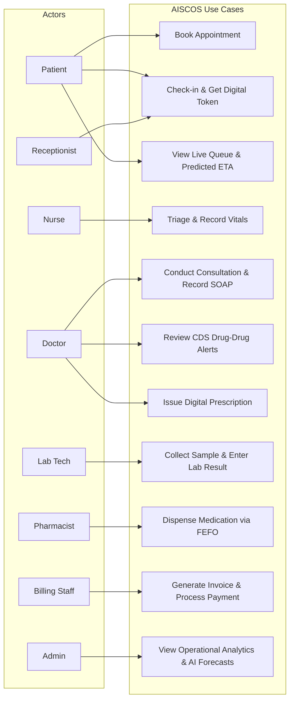
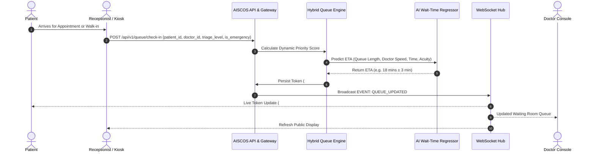
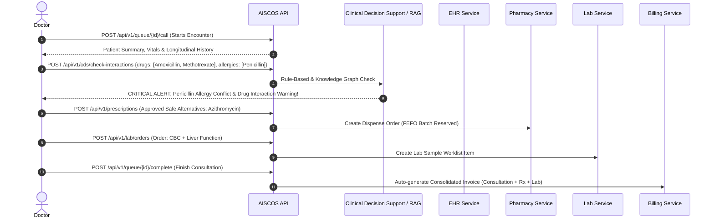
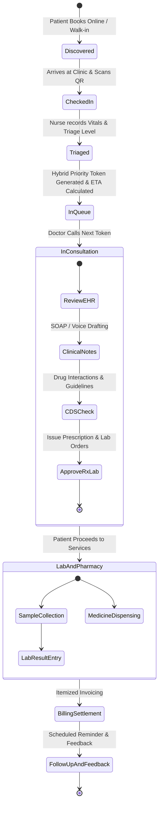

# AISCOS — System Architecture & Diagrams Specification

## 1. System Architecture Overview

```mermaid
graph TD
    subgraph Client_Layer ["Client Presentation Layer (React 18 + TS + Tailwind)"]
        P_UI[Patient Portal]
        D_UI[Doctor Clinical Workspace]
        R_UI[Receptionist & Queue Kiosk]
        N_UI[Nurse Triage Portal]
        PH_UI[Pharmacy Console]
        L_UI[Laboratory Console]
        B_UI[Billing & Finance Console]
        A_UI[Admin & Analytics Dashboard]
    end

    subgraph API_Gateway ["API Gateway & Middleware Layer (FastAPI)"]
        AUTH[JWT / RBAC Security Middleware]
        AUDIT[Audit Interceptor & Access Logger]
        WS_HUB[WebSocket Real-Time Event Hub]
        ROUTERS[RESTful API v1 Routers]
    end

    subgraph Core_Services ["Application Core Services Layer"]
        QUE_SVC[Hybrid Priority Queue Engine]
        EHR_SVC[Clinical Record & Encounter Service]
        RX_SVC[Structured Prescription Engine]
        LAB_SVC[Laboratory Order & Result Service]
        PHARM_SVC[FEFO Pharmacy & Inventory Service]
        BILL_SVC[Automated Billing & Insurance Service]
        NOTIF_SVC[Multi-Channel Notification Dispatcher]
        FHIR_SVC[HL7 FHIR Interoperability Adapter]
    end

    subgraph AI_ML_Subsystem ["AI & Decision Support Subsystem"]
        AI_WAIT[Waiting-Time Regressor - GradientBoosting]
        AI_NOSHOW[No-Show Predictor - RandomForest]
        AI_CDS[Clinical Decision Support & Drug Checker]
        AI_RAG[Evidence Medical Guidelines Vector RAG]
        AI_SPEECH[Speech-to-Clinical Notes Parser]
        AI_SENT[Patient Sentiment & Feedback Classifier]
    end

    subgraph Data_Storage ["Persistence & Cache Layer"]
        DB[(PostgreSQL / SQLite Database)]
        CACHE[(In-Memory / Redis State Cache)]
        DOC_VAULT[(Secure Document Storage)]
    end

    Client_Layer <==>|HTTPS REST & WSS| API_Gateway
    API_Gateway --> Core_Services
    Core_Services <--> AI_ML_Subsystem
    Core_Services <--> Data_Storage
    AI_ML_Subsystem <--> Data_Storage
```

---

## 2. Data Flow Diagrams (DFD)

### 2.1 DFD Level 0 (Context Diagram)

### 2.2 DFD Level 1 (Decomposition)

---

## 3. Use Case Diagram

---

## 4. Sequence Diagrams

### 4.1 Check-in, Priority Queueing & AI Waiting-Time Update

### 4.2 Doctor Consultation, Clinical CDS & Electronic Fulfillment

---

## 5. Activity Diagram (Complete Patient Journey)

