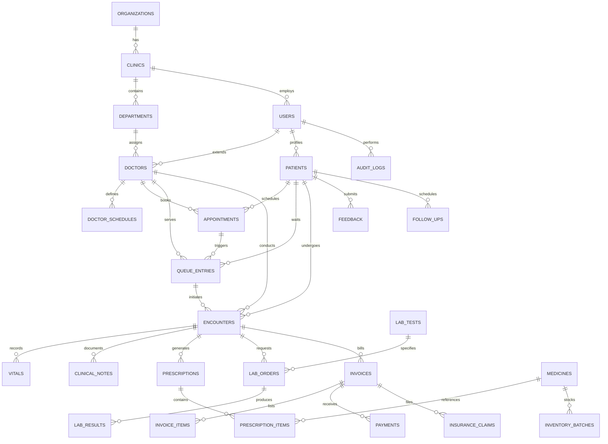

# AISCOS — Database Schema & Entity-Relationship Model

## 1. Entity-Relationship Diagram (Mermaid)

---

## 2. Relational Schema Data Dictionary

### Core Tables Summary:
1. `organizations`: Multi-tenant organization boundaries.
2. `clinics`: Specific hospital or clinic branch with location, license, contact.
3. `departments`: Medical specialties (Cardiology, Pediatrics, General Medicine, Orthopedics, etc.).
4. `users`: Unified identity records with email, hashed_password, role, status, phone.
5. `patients`: Longitudinal patient profile with blood group, allergies, chronic conditions, emergency contact, QR code.
6. `doctors`: Medical license, specialty, consultation fee, default slot duration, room number.
7. `doctor_schedules`: Working days, start time, end time, max patients per slot.
8. `appointments`: Date, time slot, appointment type (Routine, Follow-up, Walk-in, Emergency), status (Scheduled, Checked-In, Completed, Cancelled, No-Show).
9. `queue_entries`: Token number, status (Waiting, Called, In-Consultation, Completed, Skipped, Transferred), priority score, check-in time, estimated wait time, actual consultation start/end time.
10. `encounters`: Clinical session records linking patient, doctor, appointment, chief complaints, assessment, plan.
11. `vitals`: Temperature, systolic/diastolic BP, heart rate, respiratory rate, SpO2, weight, height, BMI, pain scale.
12. `clinical_notes`: Subjective, Objective, Assessment, Plan (SOAP), voice draft transcripts, doctor sign-off timestamp.
13. `medicines`: Generic name, brand name, drug category, form (Tablet, Syrup, Injection), strength, unit price.
14. `inventory_batches`: Batch number, medicine_id, expiry_date, quantity_in_stock, reorder_level, purchase_price.
15. `prescriptions`: Prescription code, encounter_id, patient_id, doctor_id, doctor_signature, status.
16. `prescription_items`: Medicine_id, dosage, frequency, route, duration_days, quantity, instructions, dispensed_quantity.
17. `lab_tests`: Test name, code, department, category, sample_type, normal_range_min, normal_range_max, unit, price.
18. `lab_orders`: Order number, encounter_id, patient_id, doctor_id, test_id, urgency, status (Ordered, Sample-Collected, In-Analysis, Completed, Cancelled).
19. `lab_results`: Order_id, numeric_value, text_value, is_abnormal, flags, verified_by_id, verified_at, notes.
20. `invoices`: Invoice number, patient_id, encounter_id, subtotal, discount, tax, total_amount, paid_amount, payment_status (Unpaid, Partially-Paid, Paid, Refunded).
21. `invoice_items`: Item description, category (Consultation, Lab, Pharmacy, Procedure), unit_price, quantity, total.
22. `payments`: Payment reference, invoice_id, payment_method (Cash, Card, UPI, Insurance), amount, transaction_id, status.
23. `insurance_claims`: Claim number, invoice_id, provider_name, policy_number, claim_amount, approved_amount, status.
24. `follow_ups`: Patient_id, doctor_id, encounter_id, scheduled_date, reason, reminder_sent.
25. `notifications`: User_id, title, message, channel (In-App, SMS, Email, WhatsApp), is_read, sent_at.
26. `feedback`: Patient_id, encounter_id, rating_doctor, rating_waiting, rating_facility, sentiment (Positive, Neutral, Negative), comments.
27. `audit_logs`: User_id, action, resource_type, resource_id, ip_address, user_agent, previous_state, new_state, timestamp.
28. `ai_predictions`: Prediction_type (Wait-Time, No-Show, Sentiment), input_features_json, output_json, confidence_score, actual_outcome.
